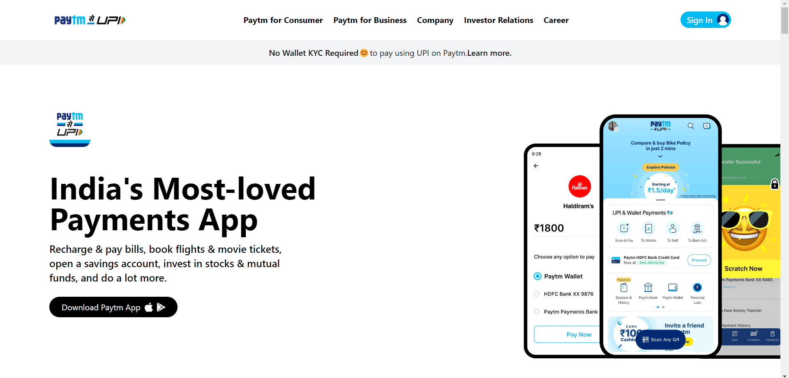
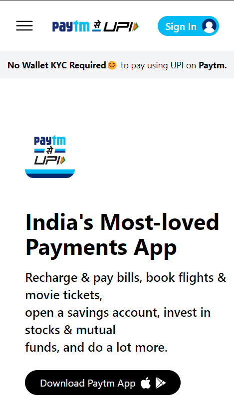

# Hey Welcome

Hi, My name is Uvesh Khatri and I have completed The Paytm Website Clone Using Tailwind CSS

# Paytm Website Clone

In this project i have created a Paytm Website from Scratch. And i learned Mobile responsive design using Tailwind CSS.

### Mobile Responsive ✅

## It took me 8 Hours to complete this project

## Tech Stack Used
- HTML5
- Tailwind CSS

[ LIve Link ](https://uveshkhatri-paytm-clone-website.netlify.app/)

